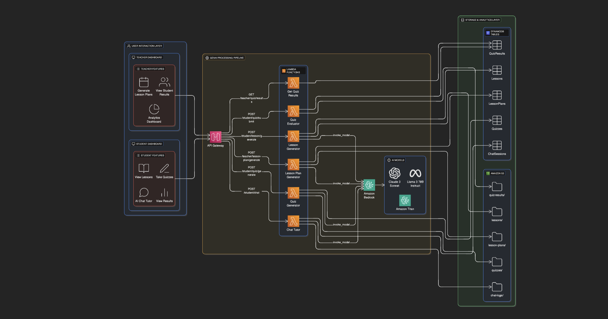
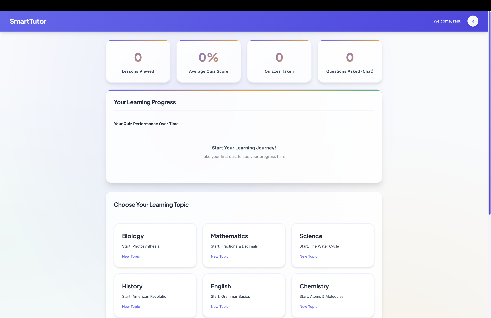
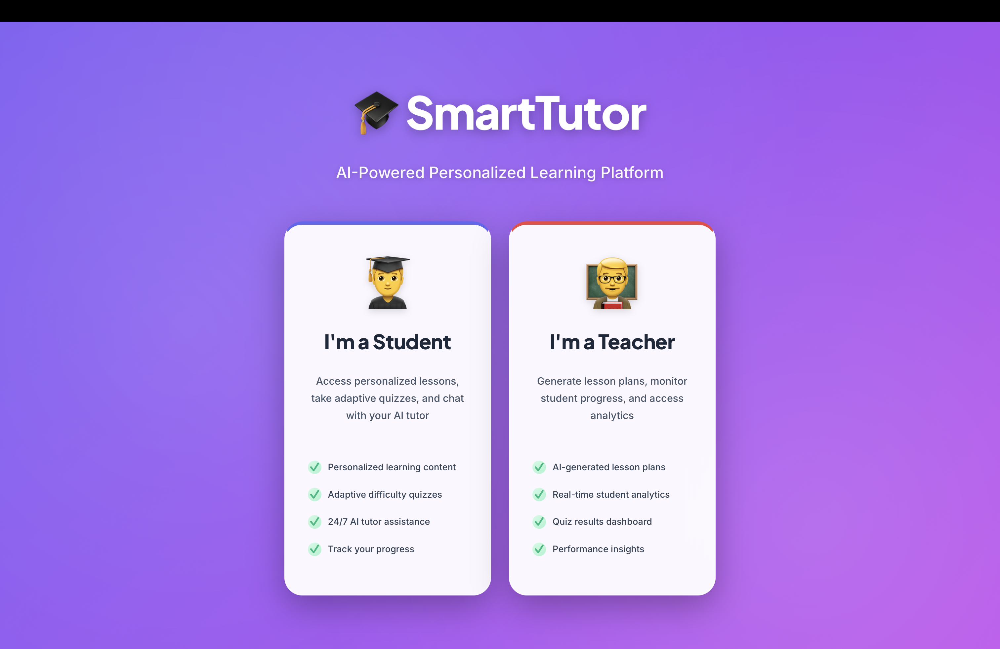
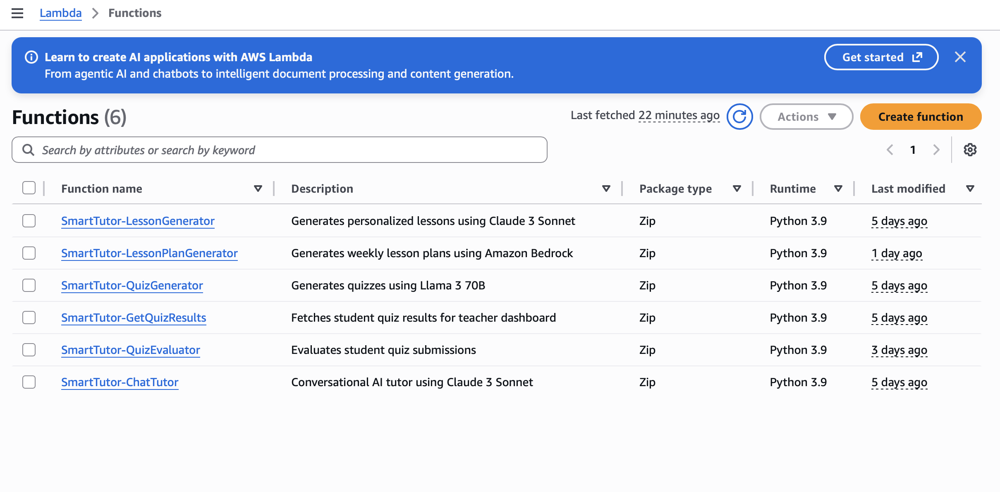
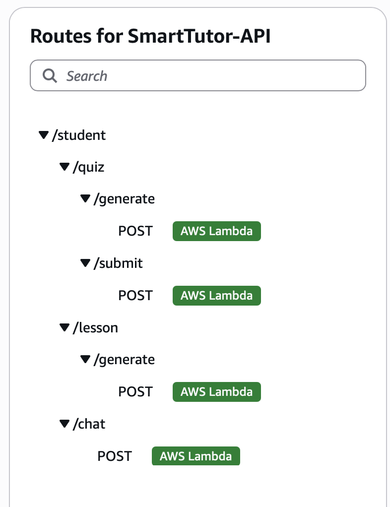
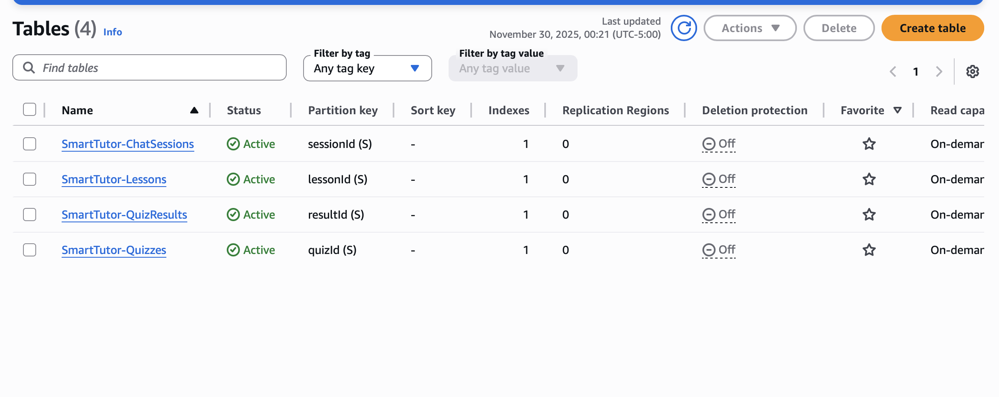

# SmartTutor - AI-Powered Personalized Learning Platform

An intelligent tutoring system that leverages AWS Bedrock and Claude AI to provide personalized learning experiences for students.

## Features

- **AI-Generated Lesson Plans**: Automatically creates customized lesson content based on subject and grade level
- **Interactive Quizzes**: Generates adaptive quizzes with difficulty adjustment
- **Chat Tutor**: Real-time AI-powered tutoring assistant
- **Student Dashboard**: Track progress, view lessons, and take quizzes
- **Teacher Dashboard**: Monitor student performance and manage lesson plans

## Architecture



The SmartTutor platform uses a serverless architecture with AWS services:
- Frontend interfaces communicate with API Gateway
- Lambda functions handle business logic
- AWS Bedrock provides AI/ML capabilities
- DynamoDB stores user data and progress
- CloudWatch monitors system performance

## Screenshots

### Student Interface

#### Student Dashboard


The main student dashboard where students can select topics and access learning materials.

#### Lesson View


AI-generated personalized lessons with adaptive difficulty levels.

#### Interactive Quiz


Adaptive quizzes that adjust difficulty based on student performance.

#### Quiz Results


Detailed feedback with performance analysis and difficulty recommendations.

#### AI Chat Tutor


Real-time AI tutoring assistant that answers questions and provides explanations.

### Teacher Interface

#### Teacher Dashboard


Analytics dashboard for monitoring student progress and performance.

#### Lesson Plan Generator


AI-powered lesson plan generation tool for teachers.

### AWS Infrastructure

#### Lambda Functions


Serverless backend functions deployed on AWS Lambda.

#### API Gateway


RESTful API endpoints for frontend-backend communication.

#### DynamoDB Tables


NoSQL database storing student progress and quiz results.

## Project Structure

```
smarttutor-solution-asset/
├── backend/
│   ├── lambda-functions/      # AWS Lambda functions
│   ├── config/               # Backend configuration
│   └── deploy_backend.sh     # Deployment script
├── bedrock-demo/             # Standalone Bedrock demos
├── ui-prototype/             # Frontend HTML/CSS/JS
│   ├── pages/               # Individual page components
│   ├── js/                  # JavaScript files
│   └── css/                 # Stylesheets
└── aws_images/              # AWS console screenshots
```

## Prerequisites

- Python 3.9+
- AWS Account with Bedrock access
- AWS CLI configured
- Modern web browser

## Quick Start

### 1. Create Virtual Environment

```bash
python3 -m venv venv
source venv/bin/activate  # On Windows: venv\Scripts\activate
```

### 2. Install Dependencies

```bash
pip install -r requirements.txt
```

### 3. Configure AWS

```bash
aws configure
# Enter your AWS Access Key ID
# Enter your AWS Secret Access Key
# Enter your default region (e.g., us-east-1)
```

### 4. Test Bedrock Demos (Optional)

```bash
cd bedrock-demo/
python lesson_generator_demo.py
python quiz_generator_demo.py
python chat_tutor_demo.py
```

### 5. Deploy Backend to AWS

```bash
cd backend/
chmod +x deploy_backend.sh
./deploy_backend.sh
```

### 6. Launch UI Prototype

```bash
cd ui-prototype/
python -m http.server 8000
```

Open your browser to: `http://localhost:8000`

## Deployment Scripts

- `deploy_backend.sh` - Deploys all Lambda functions and creates API Gateway
- `deploy_student_features.sh` - Deploys student-specific features
- `deploy_lesson_plan_fix.sh` - Fixes and redeploys lesson plan functionality
- `setup_api_routes.sh` - Configures API Gateway routes
- `test_api.sh` - Tests deployed API endpoints

## AWS Services Used

- **AWS Bedrock**: Claude AI model for content generation
- **AWS Lambda**: Serverless backend functions
- **API Gateway**: REST API endpoints
- **DynamoDB**: Student progress and quiz results storage
- **S3**: Static asset storage (optional)

## API Endpoints

- `/lesson-generator` - Generate personalized lessons
- `/quiz-generator` - Create adaptive quizzes
- `/chat-tutor` - Interactive AI tutoring
- `/quiz-evaluator` - Evaluate student quiz responses
- `/get-quiz-results` - Retrieve quiz performance data

## Configuration

Edit `backend/config/backend_config.json` to customize:
- AWS region
- Lambda function names
- API Gateway settings
- DynamoDB table names

## Development

### Local Testing

The `bedrock-demo/` folder contains standalone scripts for testing Bedrock functionality without deploying to AWS.

### Frontend Development

The UI prototype uses vanilla JavaScript and can be modified in the `ui-prototype/` directory. Update `js/api-config.js` with your deployed API Gateway URL.

## Troubleshooting

- **AWS Bedrock Access Denied**: Request model access in AWS Console → Bedrock → Model Access
- **Lambda Function Errors**: Check CloudWatch Logs for detailed error messages
- **API Gateway 404**: Verify API routes are configured correctly with `setup_api_routes.sh`

